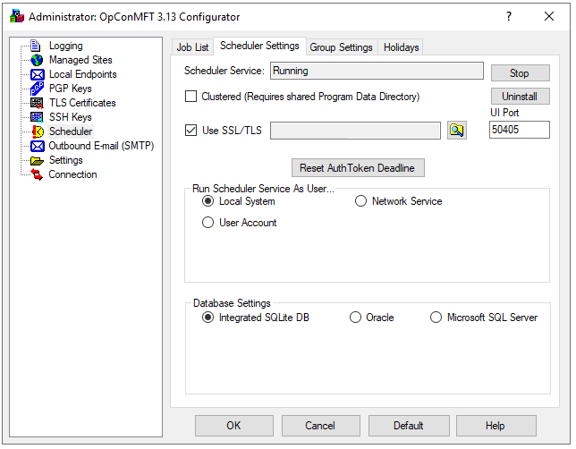
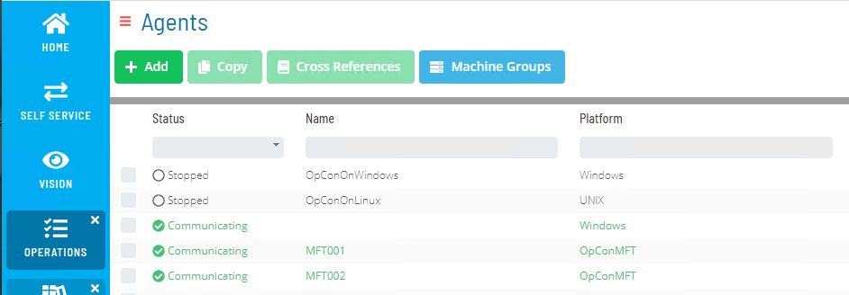

# MFT Agent installation

## What is it?

The MFT Agent installation procedure sets up the OpCon MFT Agent on a Windows server and connects it to an OpCon environment so that file transfer jobs can be scheduled and run.

- Use this when performing a new installation of the OpCon MFT Agent on a server
- Use this when upgrading an existing OpCon MFT Agent to a newer version
- After installation, the agent must be configured in Solution Manager and authenticated before file transfer jobs can run

The OpCon MFT environment consists of an OpCon MFT Agent and the SMAMftAgentProxy, which provides the communication link between OpCon and the OpCon MFT Agent. The SMAMftAgentProxy is contained within the SMANetCom environment and is installed automatically when the core OpCon component is installed.

There is a one-to-one relationship between an OpCon environment and an OpCon MFT Agent due to the authentication token used between them.

## OpCon MFT Agent installation

The OpCon MFT Agent software can be downloaded using the OpCon Web Installer. It is listed as **SMA OpConMFT** under the Agents section. The software currently has a download option only. Once downloaded, the installer can be started manually outside the OpCon Web Installer.

The agent installation consists of running the installer program and accepting the license agreement. After the installation, if a system restart is required, restart the system.

### Retrieve the OpCon MFT Agent port number

After the restart, retrieve the port number for communication with OpCon. This port number was automatically configured during the installation process.

To retrieve the port number, complete the following steps:

1. In the Windows Start menu, open the **OpConMFT 3.13** folder and select **Desktop Configurator**. The Configurator opens.
2. Select the **Scheduler** option from the tree view, then select **Scheduler Settings**. The port number is displayed in the **UI Port** field.

### Enable SSL/TLS

The installer creates a self-signed certificate for `localhost` and turns on **Use SSL/TLS**, so the web UI uses HTTPS by default. Replace that certificate with one issued for the server's host name so that browsers and OpCon trust the connection. To replace the certificate, complete the following steps:

1. In the Configurator, select the **TLS Certificates** option from the tree view and select **Create**.
2. Enter the certificate information:

   | Field | Description |
   |---|---|
   | **City/Town** | Enter the name of your city or town |
   | **Organization** | Enter the name of your organization |
   | **State/Province/Region** | Enter the name of your region |
   | **Common Name** | Enter a name for the certificate (for example, `OpConMFTxxx` where `xxx` is a unique value if you have more than one OpCon MFT Agent) |
   | **Country** | Enter the name of your country |
   | **Unit** | Enter the name of your unit within your organization |
   | **Password** | Enter a password to associate with the certificate |
   | **Verify Password** | Re-enter the password |
   | **E-mail Address** | Enter a valid email address to associate with the certificate |

3. Select **Create Self Signed** to create a self-signed certificate, or select **Create Signing Request** to produce information for purchasing a certificate from a CA.
4. On the **Scheduler Settings** screen, select the **Use SSL/TLS** option.
5. Select the browse option next to the **Use SSL/TLS** field and select the self-signed certificate you created or a certificate you imported.

   

### Define the email SMTP server connection

The OpCon MFT Agent can be configured to send notifications. To enable notifications, complete the following steps:

1. Select the **Outbound E-mail (SMTP)** option from the tree view and select the **Add** button.

   

2. Set the required options to configure the connection to the SMTP service:

   | Field | Description |
   |---|---|
   | **Site Name** | Enter a name to identify the SMTP connection |
   | **Server URL / IP Address** | Enter the address of the SMTP service |
   | **Server Port** | Adjust the port number if required (default is 25) |
   | **UserId / Password** | Enter credentials for the SMTP service |
   | **No TLS / Explicit TLS / Implicit TLS** | Select the TLS option for the SMTP service |
   | **From** | Enter the name to use as the sender for all notifications from the OpCon MFT Agent |
   | **Send To** | Enter a recipient address to use when the **Test** button is selected |

3. Select the **Test** button to send a test message. If the connection fails, the software tests various TLS and port options to find a valid connection.
4. Once changes are complete, restart the **SMA OpConMFT 3.13 Scheduler Service**.

:::note
After the OpCon MFT Agent is installed, OpCon can complete the initial authentication for 24 hours. If the OpCon MFT Agent configuration in OpCon is not completed within this window, an error indicates that the token is not available. If this occurs, select the **Reset AuthToken Deadline** button on the **Scheduler Settings** tab of the OpConMFT Configurator to open a new 30-minute authentication window.
:::

## OpCon MFT Agent configuration

The configuration of the OpCon MFT Agent is completed using Solution Manager. To configure the agent, complete the following steps:

1. In Solution Manager, select **Library** and under the **Administration** menu select **Agents**.

   

2. Select **+ Add** to configure a new OpCon MFT Agent.
3. Enter a name for the agent and select **OpConMFT** from the **Machine Type** list.
4. Select the **General Settings** tab and enter the address information, the Max Concurrent Jobs value, and the Socket Number (the **UI Port** number retrieved from the OpCon MFT Agent Scheduler Settings tab).

   

5. Select the **Save** button.
6. Select the **Communications Settings** tab and enter the **JORS Port Number**, which is the same port number used in the General Settings tab.
7. Select the **Save** button.
8. Go to the **Operational Agents** screen and select the created OpCon MFT Agent. The AgentSelection tab is displayed, which includes an **Authentication** button.
9. Select the **Authentication** button. A successful authentication message is displayed. The OpCon MFT Agent can then be started.

:::note
The OpCon MFT Agent accepts the initial authentication for 24 hours after it is installed. If authentication fails, OpCon can display a message such as **Unable to update authentication token for machine — The request was cancelled due to the configured HttpClient.Timeout of 100 seconds**. If that window has passed, select **Reset AuthToken Deadline** on the **Scheduler Settings** tab of the OpConMFT Configurator. This clears the agent's stored authentication token, so any existing authentication with OpCon stops working, and opens a 30-minute window in which to authenticate the agent from OpCon again.
:::

## MFT Agent upgrade

The installer replaces an existing installation when you upgrade from version 3.13.0 or later. Earlier versions install alongside the new version, and you import their settings with the Settings Importer.

Updating the OpCon MFT Agent requires careful preparation to avoid communication issues. To upgrade the agent, complete the following steps:

1. Back up the configuration files. In the installation directory (default: `C:\Program Files\OpConMFT 3.13`), open the `programdata` folder and copy `config.xml` and `SchedulerService.sqlite` to a safe location. A server snapshot is also recommended as an additional restore point.
2. Confirm that no OpCon MFT jobs are currently running.
3. Stop the OpCon MFT Agent communication to prevent new job runs during the upgrade.
4. Stop the Windows OpCon MFT services.
5. Run the installer for the latest version and confirm it finishes correctly. When you upgrade from 3.13.0 or later, it replaces the existing version.
6. Start the services and confirm that the MFT web UI is accessible from both the MFT server and the OpCon server.
7. Reconnect the agent in OpCon. The agent should authenticate automatically.
8. If authentication does not succeed automatically, select the **Reset AuthToken Deadline** button on the **Scheduler Settings** tab of the OpConMFT Configurator and re-authenticate.

## FAQs

**What happens if I miss the 24-hour authentication window after installation?**

The OpCon MFT Agent accepts the initial authentication for 24 hours after it is installed. If that window has passed, select the **Reset AuthToken Deadline** button on the **Scheduler Settings** tab of the OpConMFT Configurator. This clears the agent's stored authentication token, so any existing authentication with OpCon stops working, and opens a 30-minute window in which to authenticate the agent from OpCon again. Within that window, re-authenticate from Solution Manager using the **Authentication** button on the Operational Agents screen.

**Can I have more than one OpCon MFT Agent in the same OpCon environment?**

Yes. Each OpCon MFT Agent has a one-to-one relationship with an OpCon environment via its authentication token, but you can configure multiple agents, each with its own machine definition in Solution Manager.

**What port does the OpCon MFT Agent use to communicate with OpCon?**

The port number is configured during installation and displayed in the **UI Port** field on the **Scheduler Settings** tab of the OpConMFT Configurator. This value must be entered as the Socket Number and JORS Port Number when configuring the agent in Solution Manager.

**Related topics:**

- [MFT Agent system requirements](./agent-system-requirements.md)
- [MFT Server installation](./server-installation.md)
- [Architecture](./architecture.md)
